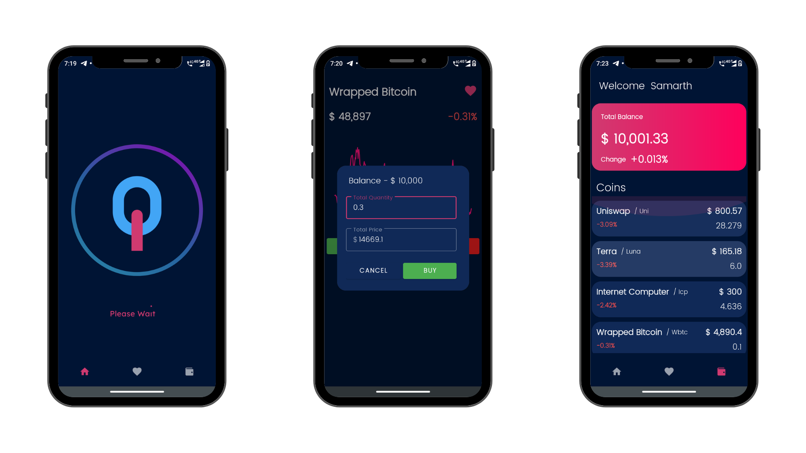

# CryptoZee

### For Downloading the App Check [Release Page](https://github.com/sinhasamarth/CryptoZee/releases/) 

# Screenshots

## Usage 
1. Get your Favourite Coin Rank, Price  History, Changes of a particular time interval , total market cap and many more.
2. Use Demo wallet to learn how crypto trading works without any fear of losing a single penny.
3. Bookmark your Favourite Coin 
## Tech Used
**Api** - [Coingecko](https://www.coingecko.com/en/api)  
**Library** -   [AAChartModel](https://github.com/AAChartModel/AAChartKit) ,
[Glide](https://github.com/bumptech/glide) , 
[Retrofit](https://github.com/square/retrofit) ,
[Lottie](https://github.com/airbnb/lottie) 
**Language** - Kotlin , XML

>No Special Permission is Required 

### Thanks for Support
  HackClub CGC Team 

 
